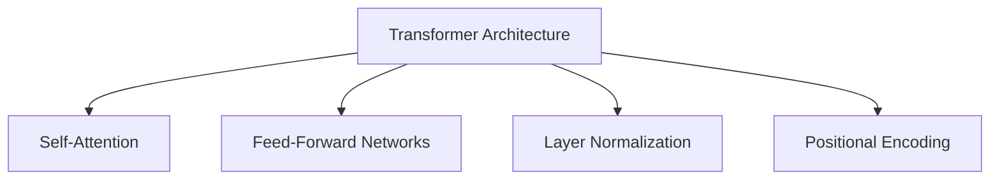
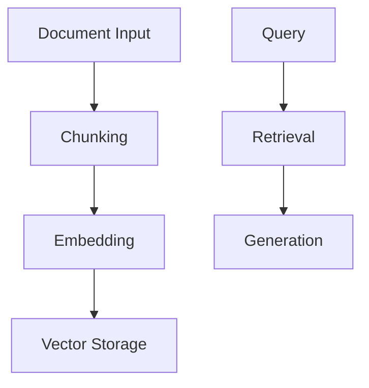

# GenAI Roadmap for Beginners | End-to-End GenAI Course 2025 | CampusX

## Table of Contents
1. [Introduction to Generative AI](#introduction-to-generative-ai)
   - [Core Concepts](#core-concepts)
   - [Industry Impact](#industry-impact)
   - [Current State Analysis](#current-state-analysis)

2. [Foundation Models](#foundation-models-a-dual-perspective-analysis)
   - [User Perspective](#user-perspective)
   - [Builder Perspective](#builder-perspective)
   - [Shared Considerations](#shared-considerations)
   - [Application Domains](#application-domains)
   - [Key Metrics and Evaluation](#key-metrics-and-evaluation)

3. [Foundation Model Concepts](#foundation-model-concepts-dual-perspective-analysis-)
   - [User Perspective](#1-user-perspective-)
   - [Builder Perspective](#2-builder-perspective-)
   - [Implementation Guidelines](#4-implementation-guidelines-)
   - [Best Practices](#5-best-practices-)

4. [Builder's Guide](#the-builders-perspective-foundation-model-development-guide-)
   - [Transformer Architecture](#1-transformer-architecture-fundamentals-)
   - [Types of Transformers](#2-types-of-transformers-)
   - [Pretraining Pipeline](#3-pretraining-pipeline-)
   - [Optimization Techniques](#4-optimization-techniques-)
   - [Deployment Considerations](#7-deployment-considerations-)

5. [User's Guide](#the-users-perspective-llm-implementation-guide-)
   - [Building Applications](#1-building-basic-llm-applications-)
   - [LLM Options](#2-open-source-vs-closed-source-llms-)
   - [Framework Deep Dives](#4-framework-deep-dives-)
   - [RAG Implementation](#6-rag-implementation-)
   - [Best Practices](#best-practices-checklist)

6. [Career Paths](#understanding-aiml-career-paths-do-we-need-both-sides-)
   - [Role Analysis](#role-analysis)
   - [Career Recommendations](#career-path-recommendations)
   - [Decision Framework](#decision-framework-)
   - [Learning Paths](#learning-path-recommendations-)
   - [Resources](#resources-for-learning-)

Generative AI (often abbreviated as GenAI) refers to a category of artificial intelligence techniques that are designed to generate new, original content by learning patterns from existing data. Here's a breakdown of what that means:

1. **Learning from Data:**  
   Generative AI models are trained on large datasets containing examples of the type of content they are meant to generate—whether that's text, images, music, code, or other media. Through this training process, the models learn the underlying structures, styles, and patterns present in the data.

2. **Mimicking Human Creativity:**  
   Once trained, these models can create new content that often mimics human creativity. For instance, a generative text model can write articles, stories, or answer questions, while a generative image model might create artwork or modify images.

3. **Key Technologies:**  
   - **Transformers:** Models like OpenAI's GPT (for text) use transformer architectures, which are particularly good at understanding and generating natural language.
   - **Generative Adversarial Networks (GANs):** These involve two neural networks—a generator and a discriminator—that work together to produce realistic images, videos, or other forms of content.
   - **Diffusion Models:** These are a newer class of generative models used in creating high-quality images by gradually transforming noise into detailed images.

4. **Applications:**  
   - **Text Generation:** Writing articles, summarizing content, chatbots, and even coding assistance.
   - **Image Creation:** Generating artwork, enhancing photos, or designing new visual concepts.
   - **Music and Audio:** Composing new music or generating sound effects.
   - **Code Generation:** Assisting in software development by generating code snippets or entire programs based on user input.

Generative AI has broad implications for creativity, productivity, and even ethical considerations, as it can blur the lines between human-generated and machine-generated content. Its ability to create high-quality, original work is transforming industries ranging from entertainment to software development.

Generative AI is making waves across many sectors. Here’s how it impacts the areas you mentioned:

1. **Customer Support:**  
   - **Enhanced Chatbots & Virtual Assistants:** Generative AI powers conversational agents that can handle customer queries in real time, offering personalized responses and reducing wait times.  
   - **Automated Ticketing and Resolution:** It can automatically analyze support tickets, classify issues, and even suggest resolutions, streamlining support workflows.  
   - **Sentiment Analysis:** By understanding the nuances in customer communications, AI can flag urgent issues and ensure sensitive cases receive prompt human intervention.

2. **Education:**  
   - **Personalized Learning:** Generative AI can create customized educational content tailored to individual learning styles and needs, from practice questions to detailed explanations.  
   - **Tutoring and Assistance:** AI-driven tutoring systems provide students with on-demand help, explanations, and even step-by-step problem-solving guides.  
   - **Content Generation:** Teachers and educators can use AI to generate lesson plans, quizzes, and supplementary materials, saving time and resources.

3. **Content Creation:**  
   - **Writing and Journalism:** AI can draft articles, blog posts, or even creative stories by analyzing vast amounts of data and mimicking various writing styles.  
   - **Visual and Multimedia Content:** In design and advertising, generative AI tools can produce images, videos, and animations, supporting creative campaigns and rapid prototyping.  
   - **Personalization at Scale:** Marketing teams leverage AI to generate personalized content for different audience segments, improving engagement and conversion rates.

4. **Software Development:**  
   - **Code Generation:** Generative AI models like GitHub Copilot assist developers by suggesting code snippets, automating repetitive coding tasks, and even generating boilerplate code.  
   - **Bug Detection and Debugging:** AI tools can help identify potential bugs or inefficiencies in code and suggest improvements, enhancing code quality and reducing development time.  
   - **Documentation and Learning:** AI can generate documentation, tutorials, and learning resources, making it easier for developers to understand complex codebases or new programming languages.

Overall, generative AI is not only boosting efficiency and productivity in these areas but also opening up new possibilities for innovation and creativity. Each of these impact areas benefits from AI's ability to analyze data, understand context, and generate human-like output, transforming traditional processes into more dynamic, responsive, and user-centric systems.

Generative AI (GenAI) has made significant strides and is influencing a wide range of sectors. Here’s a detailed look at the various aspects of your question:

1. **Is GenAI Successful?**  
   - **Proven Capabilities:**  
     GenAI has demonstrated impressive capabilities in tasks such as natural language understanding, image generation, code assistance, and more. Tools like ChatGPT, DALL·E, and GitHub Copilot are prime examples of successful applications.
   - **Widespread Adoption:**  
     Its rapid adoption across industries—from customer service to content creation—indicates that it’s not only technically successful but also practically valuable.

2. **Does It Solve Real-World Problems?**  
   - **Practical Applications:**  
     GenAI addresses everyday challenges such as automating routine tasks, enhancing productivity, and providing personalized user experiences. For instance, AI-driven chatbots improve customer service, while automated content generation assists in marketing and communications.
   - **Innovation in Critical Areas:**  
     In areas like healthcare, finance, and education, GenAI helps in tasks such as medical diagnosis assistance, fraud detection, and personalized learning, thus solving complex real-world issues.

3. **Is It Useful on a Daily Basis?**  
   - **Enhanced Productivity:**  
     Many people interact with GenAI daily without even realizing it—through smart assistants, predictive text in emails, or recommendation systems on streaming platforms.
   - **Integration into Workflows:**  
     For professionals, tools that generate code, summarize documents, or produce creative content are becoming indispensable, making GenAI a practical tool in daily work routines.

4. **Is It Impacting World Economics?**  
   - **Economic Efficiency:**  
     GenAI contributes to significant efficiency gains in various industries by automating repetitive tasks and optimizing processes. This can lead to cost savings and increased productivity, which positively impacts economic growth.
   - **Market Disruption and Transformation:**  
     As industries adopt GenAI, new business models emerge while traditional ones evolve. This dynamic shift is influencing global markets, investments in technology, and the competitive landscape.

5. **Is It Creating New Jobs?**  
   - **Emergence of New Roles:**  
     The GenAI revolution is spurring the creation of jobs in AI research, machine learning engineering, data science, and related fields. Roles focused on ethics, regulation, and AI system maintenance are also on the rise.
   - **Skill Shifts:**  
     While some routine jobs may be automated, there’s a growing demand for skills that complement AI, such as creative problem-solving, strategic thinking, and interdisciplinary expertise that combines domain knowledge with AI proficiency.

6. **Is It Accessible?**  
   - **Wide Availability:**  
     Many GenAI tools are accessible via cloud-based platforms and APIs, allowing businesses and individuals to integrate AI functionalities without significant upfront investments in infrastructure.
   - **Democratization of AI:**  
     Open-source projects and educational resources have lowered the barriers to entry. This democratization means that not only large enterprises but also small businesses and individual developers can harness the power of GenAI.
   - **Ongoing Challenges:**  
     Despite its accessibility, there are still challenges related to data privacy, regulatory compliance, and the digital divide. Efforts are ongoing to ensure that the benefits of GenAI are broadly shared and that its deployment is ethical and secure.

### In Summary
Generative AI is successful in many domains, solving tangible problems and enhancing daily life and work. It has a notable economic impact, driving both efficiency and new job creation while also making significant contributions to industries ranging from customer support to software development. Although challenges remain, especially in ensuring broad and equitable access, the overall trajectory of GenAI suggests that it is a powerful and transformative technology in today’s world.


# Foundation Models: A Dual Perspective Analysis

## User Perspective

### Understanding Foundation Models
- Foundation models represent a paradigm shift in AI, serving as versatile base models that can be adapted for numerous downstream tasks through fine-tuning or prompting. Users interact with these models through interfaces that abstract away the underlying complexity, allowing focus on practical applications and outcomes.

### Key Benefits
- Reduced need for task-specific training data and expertise
- Flexibility to handle multiple types of tasks with a single model
- Access to sophisticated AI capabilities through simple APIs
- Cost-effective compared to building specialized models from scratch
- Regular improvements through model updates from providers

### Practical Considerations
- Understanding prompt engineering principles to effectively communicate with models
- Managing computational resources and API costs
- Evaluating model outputs for accuracy and reliability
- Implementing appropriate safety measures and content filtering
- Maintaining awareness of model limitations and potential biases

## Builder Perspective

### Core Technical Components
- Architecture selection (Transformer variants, mixture of experts, etc.)
- Training data curation and preprocessing at massive scale
- Distributed training infrastructure and optimization
- Model evaluation and benchmarking frameworks
- System design for serving and scaling

### Development Challenges
- Managing computational requirements and training costs
- Ensuring data quality and addressing bias in training sets
- Implementing effective monitoring and debugging systems
- Optimizing model size vs. performance tradeoffs
- Developing robust evaluation metrics and testing procedures

### Infrastructure Requirements
- High-performance computing clusters
- Distributed storage systems for training data
- Real-time monitoring and logging systems
- Model serving infrastructure
- Quality assurance and testing frameworks

### Safety and Responsibility
- Implementing robust content filtering
- Developing safety measures and model alignment techniques
- Creating transparent documentation about model capabilities and limitations
- Establishing clear usage guidelines and best practices
- Maintaining ongoing monitoring and improvement processes

## Shared Considerations

### Ethical Implications
- Understanding and addressing potential biases
- Ensuring responsible deployment and usage
- Managing privacy concerns and data protection
- Considering environmental impact of large-scale models
- Developing frameworks for accountability

### Future Developments
- Emerging architectures and training approaches
- Improvements in efficiency and resource utilization
- Enhanced safety measures and control mechanisms
- Better evaluation methods and metrics
- More sophisticated fine-tuning and adaptation techniques

### Best Practices
- Regular performance monitoring and evaluation
- Implementing robust testing procedures
- Maintaining clear documentation and usage guidelines
- Establishing feedback loops for continuous improvement
- Developing contingency plans for potential issues

## Application Domains

### Current Applications
- Natural language processing and generation
- Computer vision and image generation
- Multi-modal tasks combining different data types
- Code generation and analysis
- Scientific research and discovery

### Emerging Opportunities
- Specialized domain adaptation
- Enhanced reasoning capabilities
- Improved multi-modal integration
- More sophisticated tool use and planning
- Advanced few-shot and zero-shot learning

## Key Metrics and Evaluation

### Performance Metrics
- Task-specific accuracy and quality measures
- Computational efficiency and resource usage
- Latency and throughput considerations
- Robustness and reliability metrics
- Safety and alignment measurements

### Cost Considerations
- Training and deployment infrastructure
- Ongoing operational expenses
- Optimization and efficiency improvements
- Resource scaling strategies
- ROI analysis frameworks

# Foundation Model Concepts: Dual Perspective Analysis 🤖

## 1. User Perspective 👤

### Prompt Engineering 📝
- **Definition**: Art and science of effectively communicating with AI models
- **Key Components**:
  - System prompts design
  - Context structuring
  - Input formatting
  - Output templating

### RLHF (Reinforcement Learning from Human Feedback) 🔄
- **User Benefits**:
  - More aligned model responses
  - Better understanding of user intent
  - Improved safety features
  - Enhanced output quality

### RAG (Retrieval-Augmented Generation) 📚
- **Applications**:
  - Enhanced factual accuracy
  - Up-to-date information access
  - Domain-specific knowledge integration
  - Reduced hallucinations

## 2. Builder Perspective 🛠️

### Pretraining Architecture 🏗️
- **Core Elements**:
  - Model architecture selection
  - Training data preparation
  - Optimization strategies
  - Scaling considerations

### Quantization Techniques ⚙️
- **Implementation Aspects**:
  - Model compression methods
  - Inference optimization
  - Deployment efficiency
  - Performance tuning

### AI Agents Framework 🤖
- **Development Focus**:
  - Agent architecture design
  - Task planning systems
  - Tool usage integration
  - Memory management

### Vector Databases 🗄️
- **Technical Components**:
  - Embedding storage
  - Similarity search
  - Index optimization
  - Scaling solutions

### Fine-Tuning Systems 🎯
- **Implementation Details**:
  - Parameter efficient methods
  - Domain adaptation
  - Performance monitoring
  - Quality assurance

## 3. Shared Considerations 🤝

### Performance Optimization
- **Key Metrics**:
  - Latency
  - Throughput
  - Resource utilization
  - Quality benchmarks

### Safety & Ethics
- **Critical Aspects**:
  - Bias mitigation
  - Content filtering
  - Privacy protection
  - Responsible AI practices

## 4. Implementation Guidelines 📋

### For Users
```markdown
1. Start with prompt engineering basics
2. Understand RAG integration points
3. Leverage RLHF benefits
4. Monitor performance metrics
5. Implement safety guidelines
```

### For Builders
```markdown
1. Design robust architecture
2. Optimize through quantization
3. Implement efficient vector storage
4. Develop agent frameworks
5. Establish fine-tuning pipelines
```

## 5. Best Practices 🎯

### Technical Excellence
- Maintain documentation
- Implement testing protocols
- Monitor performance
- Ensure scalability

### Safety & Responsibility
- Follow ethical guidelines
- Implement security measures
- Ensure data privacy
- Monitor model behavior

## 6. Future Developments 🚀

### Technical Advancements
- Enhanced architectures
- Improved efficiency
- Better safety measures
- Advanced agent capabilities

### Industry Impact
- Broader adoption
- New use cases
- Regulatory considerations
- Market evolution

---

## Quick Reference Table 📊

| Concept | User Focus | Builder Focus |
|---------|------------|---------------|
| Prompt Engineering | Usage & Templates | System Design |
| RLHF | Feedback Provision | Implementation |
| RAG | Knowledge Integration | System Architecture |
| Pretraining | Use Cases | Architecture Design |
| Quantization | Performance Impact | Implementation |
| Agents | Interaction | Development |
| Vector DBs | Query Patterns | Infrastructure |
| Fine-Tuning | Application | System Design |

## Study Resources 📚
- Documentation references
- Implementation guides
- Best practice documents
- Research papers
- Community forums
- Technical blogs

# The Builder's Perspective: Foundation Model Development Guide 🏗️

## 1. Transformer Architecture Fundamentals 🔧

### Core Architecture Components


### Implementation Considerations
- **Attention Mechanisms**: Multi-head attention patterns
- **Layer Configuration**: Depth vs. width tradeoffs
- **Normalization Strategies**: Pre-norm vs. post-norm
- **Activation Functions**: Selection and placement

## 2. Types of Transformers 🔄

### Encoder-Only Models (BERT) 📚
- **Architecture Focus**: Bidirectional context understanding
- **Key Applications**:
  - Text classification
  - Named entity recognition
  - Question answering
- **Design Considerations**:
  - Masked language modeling
  - Next sentence prediction
  - Contextual embeddings

### Decoder-Only Models (GPT) ✍️
- **Architecture Focus**: Autoregressive text generation
- **Key Applications**:
  - Text generation
  - Completion tasks
  - Creative writing
- **Design Considerations**:
  - Causal attention masks
  - Token prediction
  - Generation strategies

### Encoder-Decoder Models (T5) 🔄
- **Architecture Focus**: Sequence-to-sequence tasks
- **Key Applications**:
  - Translation
  - Summarization
  - Structured generation
- **Design Considerations**:
  - Cross-attention mechanisms
  - Encoder-decoder interaction
  - Task-specific prompts

## 3. Pretraining Pipeline 🔨

### Training Objectives 🎯
- Masked language modeling
- Causal language modeling
- Span corruption
- Multiple task objectives

### Tokenization Strategies 📝
| Strategy | Pros | Cons |
|----------|------|------|
| BPE | Efficient vocabulary | Rare word handling |
| WordPiece | Natural word splits | Language dependency |
| SentencePiece | Language agnostic | Training complexity |

### Training Strategies ⚙️
1. **Curriculum Learning**
   - Progressive difficulty
   - Task scheduling
   - Data ordering

2. **Scale Considerations**
   - Model parallelism
   - Data parallelism
   - Pipeline parallelism

### Challenge Handling 🛠️
- **Memory Management**:
  ```python
  # Gradient checkpointing example
  def checkpoint_forward(self, x):
      return torch.utils.checkpoint.checkpoint(
          self.forward_pass, x)
  ```
- **Numerical Stability**
- **Training Dynamics**
- **Resource Optimization**

## 4. Optimization Techniques 📈

### Training Optimization
- **Learning Rate Scheduling**:
  ```python
  # Cosine learning rate schedule
  lr = base_lr * 0.5 * (1 + cos(epoch / max_epochs * pi))
  ```
- **Gradient Accumulation**
- **Mixed Precision Training**
- **Distributed Training**

### Model Compression 📦
1. **Quantization**
   - Post-training quantization
   - Quantization-aware training
   - Dynamic quantization

2. **Pruning**
   - Magnitude pruning
   - Structured pruning
   - Dynamic pruning

### Inference Optimization ⚡
- Model distillation
- KD techniques
- Batch processing
- Caching strategies

## 5. Fine-tuning Approaches 🎯

### Task-specific Tuning
- **Classification Heads**
- **Token Classification**
- **Generation Tuning**

### Instruction Tuning 📝
- Prompt engineering
- Few-shot learning
- Zero-shot adaptation

### RLHF (Reinforcement Learning from Human Feedback) 🤝
1. **Implementation Steps**:
   - Initial supervised fine-tuning
   - Reward model training
   - Policy optimization

### PEFT (Parameter-Efficient Fine-Tuning) 💡
- **LoRA**: Low-rank adaptation
- **Prefix Tuning**: Trainable prefixes
- **Adapter Layers**: Bottleneck adapters

## 6. Evaluation Framework 📊

### Metrics
```markdown
1. Task-specific metrics
2. General language metrics
3. Safety evaluations
4. Efficiency metrics
```

### Benchmarks
- GLUE/SuperGLUE
- MMLU
- BigBench
- Safety benchmarks

## 7. Deployment Considerations 🚀

### Infrastructure
- **Serving Architecture**
- **Scaling Strategy**
- **Monitoring Setup**

### Performance Optimization
- Batching strategies
- Caching mechanisms
- Load balancing

---

## 📌 Quick Reference

### Essential Tools
- 🛠️ PyTorch/TensorFlow
- 📊 Weights & Biases
- 🔍 TensorBoard
- 🚀 NVIDIA Tools

### Best Practices
1. Version control for models
2. Systematic evaluation
3. Comprehensive logging
4. Regular checkpointing
5. Safety monitoring

# The User's Perspective: LLM Implementation Guide 🚀

## 1. Building Basic LLM Applications 🛠️

### Getting Started
- Understanding system requirements
- Setting up development environment
- Choosing appropriate frameworks
- Basic implementation patterns

### Development Workflow
```markdown
1. Define use case requirements
2. Select appropriate LLM
3. Implement basic integration
4. Test and iterate
5. Deploy and monitor
```

## 2. Open Source vs Closed Source LLMs 🔄

### Open Source Options
- **Advantages**:
  - Full customization control
  - Local deployment options
  - Community support
  - Cost effectiveness
- **Popular Models**:
  - LLaMA & variants
  - BLOOM
  - T5 variants
  - GPT-J family

### Closed Source Options
- **Advantages**:
  - State-of-the-art performance
  - Managed infrastructure
  - Regular updates
  - Enterprise support
- **Popular Services**:
  - OpenAI GPT models
  - Claude
  - PaLM API
  - Cohere

## 3. Using LLM APIs 📡

### Implementation Best Practices
```python
# Example API integration pattern
async def llm_request(prompt, params):
    try:
        response = await client.completions.create(
            model="model-name",
            prompt=prompt,
            **params
        )
        return handle_response(response)
    except Exception as e:
        handle_error(e)
```

### Key Considerations
- Rate limiting strategies
- Error handling
- Cost management
- Response processing
- Fallback mechanisms

## 4. Framework Deep Dives 🔍

### LangChain
- **Core Features**:
  - Chain composition
  - Memory management
  - Tool integration
  - Agent orchestration
- **Use Cases**:
  - Document Q&A
  - Chatbots
  - Data analysis
  - Process automation

### HuggingFace
- **Key Components**:
  - Model hub access
  - Pipeline abstractions
  - Training utilities
  - Model deployment
- **Common Applications**:
  - Text classification
  - Token generation
  - Feature extraction
  - Model fine-tuning

### Ollama
- **Features**:
  - Local model management
  - Easy deployment
  - Model quantization
  - API integration
- **Use Cases**:
  - Development testing
  - Offline applications
  - Edge deployment
  - Research

## 5. Prompt Engineering Techniques 📝

### Basic Principles
1. Clear instructions
2. Context setting
3. Format specification
4. Example inclusion

### Advanced Strategies
- Chain-of-thought prompting
- Few-shot learning
- Zero-shot prompting
- System message design

## 6. RAG Implementation 📚

### Architecture Components


### Best Practices
- Optimal chunk sizing
- Embedding selection
- Vector store choice
- Query optimization
- Result reranking

## 7. Fine-Tuning Strategies 🎯

### When to Fine-tune
- Task-specific requirements
- Domain adaptation
- Performance optimization
- Custom behavior

### Implementation Steps
1. Data preparation
2. Model selection
3. Training configuration
4. Evaluation
5. Deployment

## 8. Agent Development 🤖

### Components
- Task planning
- Tool selection
- Memory systems
- Output validation

### Implementation Pattern
```python
class LLMAgent:
    def __init__(self, tools, memory):
        self.tools = tools
        self.memory = memory
    
    async def execute_task(self, objective):
        plan = await self.create_plan(objective)
        return await self.execute_plan(plan)
```

## 9. LLMOps Best Practices ⚙️

### Monitoring
- Performance metrics
- Cost tracking
- Error rates
- Usage patterns

### Deployment
- Version control
- A/B testing
- Rollback procedures
- Scale management

## 10. Miscellaneous Considerations 🔄

### Security
- Input validation
- Output filtering
- Rate limiting
- Access control

### Cost Optimization
- Caching strategies
- Batch processing
- Model selection
- Resource management

---

## 📌 Quick Reference

### Essential Tools
- 🔧 Development frameworks
- 📊 Monitoring tools
- 🔍 Testing utilities
- 🚀 Deployment platforms

### Best Practices Checklist
1. Robust error handling
2. Comprehensive logging
3. Performance monitoring
4. Security measures
5. Cost tracking

### Resources 📚
- Documentation
- Community forums
- Tutorial repositories
- Sample applications

# Understanding AI/ML Career Paths: Do We Need Both Sides? 🤔

## Role Analysis

### Builder Side: Data Scientist 📊
- **Core Focus**: Building and optimizing ML/AI models
- **Key Skills**:
  - Deep learning architectures
  - Model optimization
  - Statistical analysis
  - Research methodology
  - Data preprocessing
  - Training pipelines

### User Side: Software Developer 💻
- **Core Focus**: Implementing AI solutions in applications
- **Key Skills**:
  - API integration
  - Application development
  - System design
  - User experience
  - Deployment
  - Testing and monitoring

### AI Engineer (Overlap) 🔄
- **Bridge Role**: Connects both domains
- **Key Skills**:
  - Model deployment
  - System integration
  - Performance optimization
  - MLOps
  - Scaling solutions
  - Production implementation

## Career Path Recommendations

### Choosing Your Path 🛣️

#### For Those Starting Out
1. **Builder-Focused Path**
   - Best for: Research-oriented minds interested in model development
   - Career goal: ML Research, Model Development, Data Science
   - Learning focus: Mathematics, Statistics, ML Theory

2. **User-Focused Path**
   - Best for: Application-oriented developers
   - Career goal: AI Application Development, Product Development
   - Learning focus: Software Engineering, API Integration, Product Development

3. **Hybrid Path (AI Engineer)**
   - Best for: Those wanting maximum versatility
   - Career goal: MLOps, AI Infrastructure, Full-Stack AI
   - Learning focus: Both theoretical and practical aspects

### Do We Need Both? 🤔

#### Considerations
1. **Career Goals**
   - Specialized roles may only need one side
   - Leadership positions benefit from both
   - Product complexity determines depth needed

2. **Industry Context**
   - Startup: May need both for versatility
   - Large Company: Can specialize in one
   - Research: Focus on builder side
   - Product Development: Focus on user side

3. **Project Requirements**
   - Custom Solutions: Need builder expertise
   - API Integration: User side sufficient
   - Full Stack AI: Both valuable

## Decision Framework 📋

### When to Focus on Builder Side
- ✅ Interest in model development
- ✅ Research-oriented work
- ✅ Need to create custom models
- ✅ Working on core AI technology

### When to Focus on User Side
- ✅ Building applications
- ✅ Integration-focused work
- ✅ Using existing AI solutions
- ✅ Product development

### When to Learn Both
- ✅ MLOps role
- ✅ Startup environment
- ✅ Technical leadership
- ✅ Full-stack AI development

## Learning Path Recommendations 📚

### Builder Focus
```markdown
1. Mathematics & Statistics
2. Machine Learning Theory
3. Deep Learning
4. Model Development
5. Research Methods
```

### User Focus
```markdown
1. Software Engineering
2. API Integration
3. System Design
4. DevOps
5. Product Development
```

### Hybrid Approach
```markdown
1. Core Programming
2. Basic ML Theory
3. System Integration
4. MLOps
5. Full Stack Development
```

## Conclusion 🎯

The need to learn both sides depends on:
1. Career goals
2. Industry context
3. Role requirements
4. Project complexity

**Recommendation**: 
- Start with one focus based on immediate goals
- Gradually expand knowledge as needed
- Consider the AI Engineer path for maximum versatility
- Let project requirements guide depth of knowledge needed

## Resources for Learning 📖

### Builder Side
- Machine Learning courses
- Statistics fundamentals
- Research papers
- Mathematical foundations

### User Side
- Software development
- API documentation
- System design principles
- DevOps practices

### Hybrid Learning
- MLOps resources
- System integration guides
- Full-stack tutorials
- Case studies

