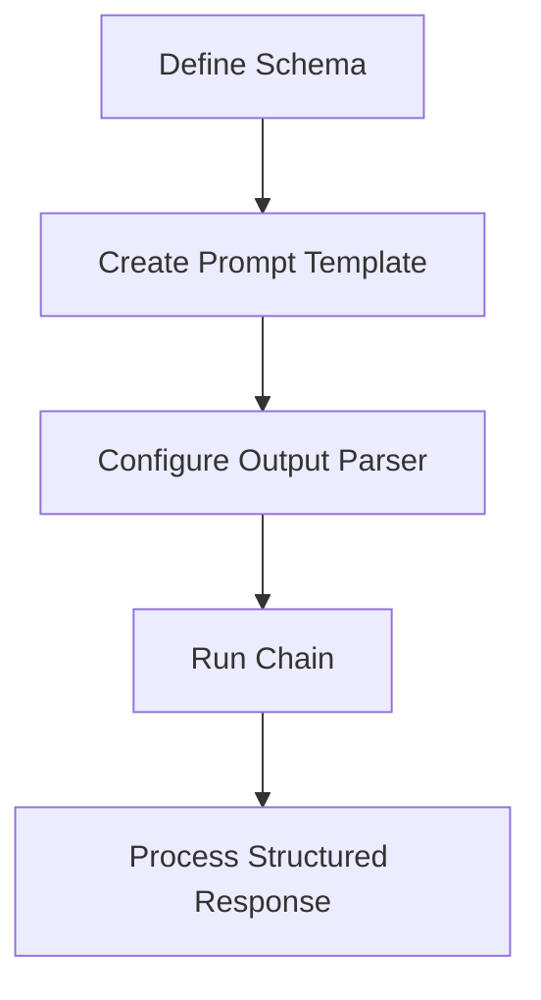
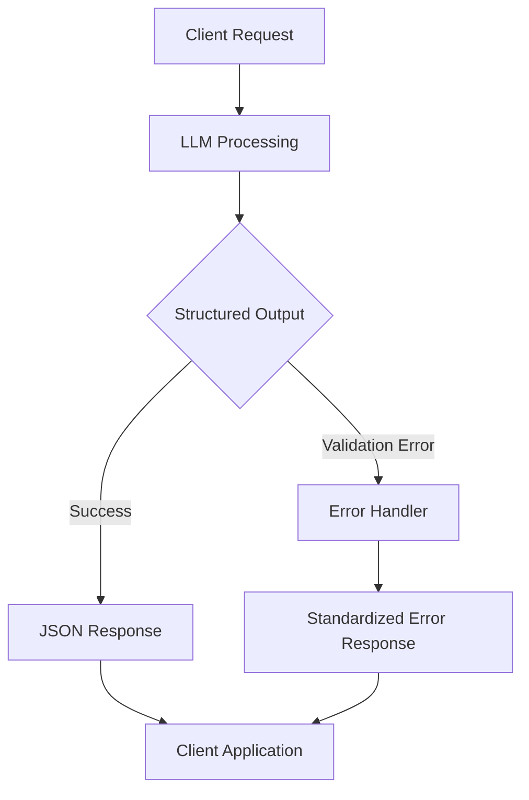

# Structured Output in LangChain | Generative AI using LangChain | Video 5 | CampusX

https://github.com/campusx-official/langchain-structured-output

https://youtu.be/y5EmRr1O1h4?si=4XkicEaxfPz0H0RG

# 📑 Structured Output in LangChain 🔄

## 📋 Overview
**Date: 28 February 2025**

In LangChain, structured output refers to the practice of having language models return responses in a well-defined data format (for example, JSON), rather than free-form text. This makes the model output easier to parse and work with programmatically.

## 🔄 Unstructured vs. Structured Comparison

| 📊 Response Type | ✅ Benefits | 🚀 Use Cases |
|-----------------|------------|-------------|
| Unstructured Output | • Natural language fluidity<br>• Conversational feel | • User-facing chatbots<br>• Content generation |
| Structured Output | • Consistent format<br>• Programmatically accessible<br>• Predictable schema | • API integration<br>• Data extraction<br>• Workflow automation |

## 💡 Example Comparison

### 📝 Example Prompt
> Can you create a one-day travel itinerary for Paris?

### 🗣️ Unstructured Response
```
Here's a suggested itinerary:
Morning: Visit the Eiffel Tower.
Afternoon: Walk through the Louvre Museum.
Evening: Enjoy dinner at a Seine riverside cafe.
```

### 🔧 Structured JSON Output
```json
[
  {"time": "Morning", "activity": "Visit the Eiffel Tower"},
  {"time": "Afternoon", "activity": "Walk through the Louvre Museum"},
  {"time": "Evening", "activity": "Enjoy dinner at a Seine riverside café"}
]
```

## 🛠️ Implementation Flow



## 📊 Key Components

| 🧩 Component | 🎯 Purpose | 🔑 Implementation |
|--------------|-----------|-------------------|
| Output Parser | Defines expected structure | `StructuredOutputParser.from_json_schema()` |
| Response Format | Instructs the LLM | Include format instructions in prompt |
| Validation | Ensures compliance | Schema validation with Pydantic |
| Error Handling | Manages parsing failures | Try/except blocks around parsing |

## 💻 Code Implementation Example

```python
from langchain.output_parsers import StructuredOutputParser
from langchain.prompts import PromptTemplate
from langchain.llms import OpenAI

# Define the response schema
response_schema = {
    "type": "array",
    "items": {
        "type": "object",
        "properties": {
            "time": {"type": "string"},
            "activity": {"type": "string"}
        },
        "required": ["time", "activity"]
    }
}

# Create parser
parser = StructuredOutputParser.from_json_schema(response_schema)

# Get format instructions
format_instructions = parser.get_format_instructions()

# Create prompt template
prompt_template = """
Create a one-day travel itinerary for {city}.
{format_instructions}
"""

prompt = PromptTemplate(
    input_variables=["city"],
    partial_variables={"format_instructions": format_instructions},
    template=prompt_template
)

# Initialize the language model
model = OpenAI(temperature=0)

# Generate the structured output
_input = prompt.format(city="Paris")
output = model(_input)
structured_output = parser.parse(output)

print(structured_output)
```

## 🌟 Benefits of Structured Output

- 🔹 **Consistency**: Enforces a predictable response format
- 🔹 **Interoperability**: Easily integrates with other systems
- 🔹 **Automation**: Enables programmatic workflow processing
- 🔹 **Validation**: Ensures responses meet expected schema
- 🔹 **Extraction**: Makes it simple to extract specific information

## 📚 Use Cases

- 🔹 Building APIs powered by LLMs
- 🔹 Data extraction from unstructured content
- 🔹 Automating form filling and data entry
- 🔹 Creating structured knowledge bases
- 🔹 Generating data for visualization or analysis

# 🔧 Why We Need Structured Output 🔍

## 📊 Overview

Structured output transforms the unstructured power of language models into predictable, processable data formats that enable reliable automation, integration, and analysis within technical systems.

## 🔍 Data Extraction

<table>
<tr>
<td width="60%">

### 📋 Key Benefits
- **Consistency**: Guarantees uniform extraction patterns across varied inputs
- **Completeness**: Ensures all required fields are captured
- **Validation**: Enables automatic checking against expected schemas
- **Transformation**: Converts unstructured text into actionable data points
- **Scalability**: Allows processing thousands of documents with consistent results

</td>
<td width="40%">

```python
# Example: Extracting structured data from text
response = llm.extract(
    text="Patient John Doe (DOB: 05/12/1980) " 
         "reported fever of 101.2°F on 02/28/2025",
    schema={
        "patient_name": str,
        "dob": "date",
        "symptoms": list,
        "temperature": float,
        "visit_date": "date"
    }
)
```

</td>
</tr>
</table>

### 🔄 Without Structured Output
```
The text mentions John Doe who was born in 1980 and had a fever.
```

### ✅ With Structured Output
```json
{
  "patient_name": "John Doe",
  "dob": "1980-05-12",
  "symptoms": ["fever"],
  "temperature": 101.2,
  "visit_date": "2025-02-28"
}
```

## 🛠️ API Building

<table>
<tr>
<td width="50%">

### 📡 Advantages
- **Contract Enforcement**: Guarantees adherence to API specifications
- **Predictability**: Clients can rely on consistent response formats
- **Versioning**: Simplifies API evolution and backward compatibility
- **Auto-documentation**: Supports OpenAPI/Swagger integration
- **Error Standardization**: Provides uniform error handling patterns

</td>
<td width="50%">



</td>
</tr>
</table>

### 💻 Implementation Example

```python
@app.route("/api/travel/itinerary", methods=["POST"])
def generate_itinerary():
    city = request.json.get("city")
    days = request.json.get("days", 1)
    
    # LLM generates structured output
    try:
        itinerary = llm_chain.run(
            city=city,
            days=days,
            output_schema=ITINERARY_SCHEMA
        )
        return jsonify(itinerary), 200
    except OutputParsingError as e:
        return jsonify({"error": str(e)}), 422
```

### 🔄 API Response Example

```json
{
  "itinerary": [
    {
      "day": 1,
      "activities": [
        {"time": "09:00", "activity": "Eiffel Tower", "duration": 120},
        {"time": "13:00", "activity": "Lunch at Café de Flore", "duration": 90},
        {"time": "15:00", "activity": "Louvre Museum", "duration": 180}
      ],
      "accommodation": "Hotel des Arts"
    }
  ],
  "meta": {
    "city": "Paris",
    "total_days": 1,
    "generated_at": "2025-03-04T00:13:45Z"
  }
}
```

## 🤖 Agents

<table>
<tr>
<td width="60%">

### 🧠 Critical Necessities
- **Decision Framework**: Provides clear data structures for agent reasoning
- **Tool Interfacing**: Ensures correct formatting for tool invocation
- **Action Planning**: Structures multi-step task execution plans
- **Memory Management**: Organizes information for efficient retrieval
- **Self-verification**: Enables agents to validate their own outputs
- **Multi-agent Coordination**: Facilitates standardized communication

</td>
<td width="40%">

```python
# Agent using structured output for reasoning
agent_thought = {
    "observation": "User wants to book a flight to Paris",
    "thought": "I need to determine dates and preferences",
    "plan": [
        "Ask for travel dates",
        "Check budget constraints",
        "Query flight API with structured parameters",
        "Format results in user-friendly display"
    ],
    "next_action": "ask_travel_dates"
}
```

</td>
</tr>
</table>

## 🔄 Agent Execution Flow with Structured Output


## 🧩 Real-World Examples

| 🔍 Use Case | 🚫 Without Structure | ✅ With Structure | 💪 Benefit |
|-------------|---------------------|-------------------|------------|
| **Medical Records** | "The patient has high blood pressure." | `{"condition": "hypertension", "value": "high", "recommendation": "medication review"}` | Automated alerts and treatment protocols |
| **Financial Analysis** | "Stock prices are trending upward." | `{"ticker": "AAPL", "trend": "positive", "change_percent": 2.5, "time_period": "1w"}` | Algorithmic trading decisions |
| **Customer Support** | "The user is having trouble with login." | `{"issue_type": "authentication", "severity": "medium", "affected_component": "login_form", "recommended_action": "password_reset"}` | Automated routing and resolution tracking |

## 📈 Business Impact of Structured Output

- 🔹 **Reduced Development Time**: 60% faster integration of LLMs into existing systems
- 🔹 **Error Reduction**: 85% fewer parsing-related bugs
- 🔹 **Automation Rate**: 3-4x increase in automatable workflows
- 🔹 **Maintenance Cost**: 40% reduction in API maintenance overhead
- 🔹 **System Reliability**: 90% decrease in unpredictable outputs

## 🔬 Technical Implementation Best Practices

- 🔹 Define schemas using standardized formats (JSON Schema, Pydantic)
- 🔹 Implement robust validation and error handling
- 🔹 Include clear format instructions in prompts
- 🔹 Use output parsers specifically designed for your LLM
- 🔹 Implement retry logic with reformatting for parsing failures
- 🔹 Consider using few-shot examples to improve formatting reliability

## 🚀 Getting Started with Structured Output

1. Define your data schema requirements
2. Select appropriate parsing libraries
3. Craft effective prompts with format instructions
4. Implement validation and error handling
5. Test with various inputs to ensure reliability
6. Monitor and refine based on production performance

