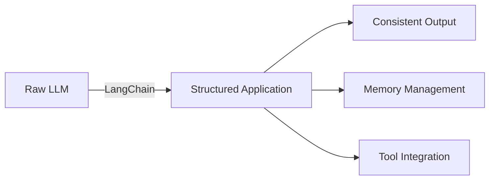
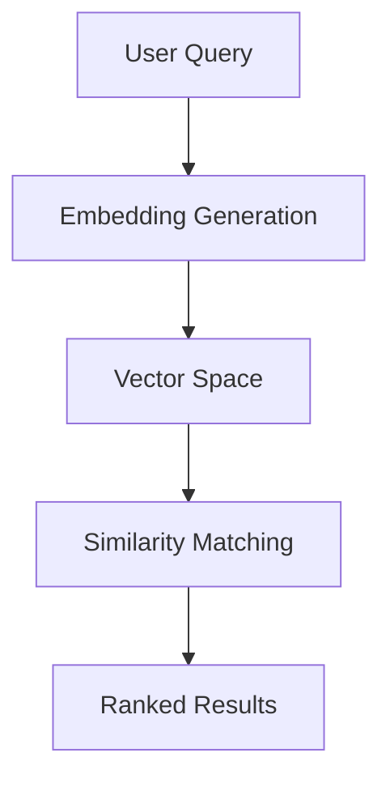
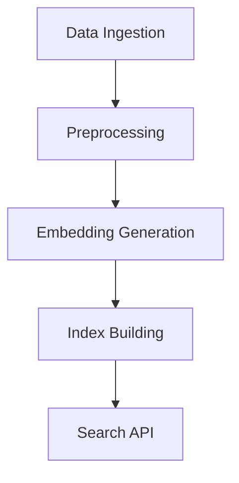
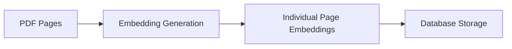

#  Introduction to LangChain 

# LangChain: A Comprehensive Framework for LLM Applications 🔗

## Overview 🌟
LangChain is an open-source framework designed to simplify the development of applications powered by Large Language Models (LLMs). It provides a structured approach for building complex LLM-based applications through modular components and chains.

## Core Components 🛠️

### 1. Chains
- **Concept**: Sequential operations that combine multiple components for complex tasks
- **Purpose**: Enable structured workflow creation for document processing, question-answering, and data analysis

### 2. Agents 🤖
- **Definition**: Autonomous components that can make decisions about which tools to use
- **Capability**: Can execute multiple steps, choosing appropriate actions based on the task at hand

### 3. Memory Systems 🧠
- **Function**: Store and manage conversation history and context
- **Types**: Various memory implementations for different use cases (buffer, summary, conversation)

## Key Features ⭐

### Prompting Layer
- **Template Management**: Structured approach to creating and managing prompts
- **Dynamic Insertion**: Variables and context integration into prompts

### Document Interaction
- **Loaders**: Support for multiple document formats
- **Splitting**: Intelligent document chunking
- **Storage**: Vector store integration for efficient retrieval

### Integration Capabilities 🔌
- **Model Support**: Works with various LLM providers
- **Tool Connection**: Easy integration with external tools and APIs
- **Database Compatibility**: Connects with various vector and traditional databases

## Use Cases 📋

### 1. Question Answering
- Document-based Q&A systems
- Chat interfaces with memory

### 2. Data Analysis
- Automated analysis pipelines
- Data extraction and summarization

### 3. Automation
- Task automation workflows
- Content generation pipelines

## Community and Ecosystem 🌐
- **Active Development**: Regular updates and improvements
- **Community Support**: Large developer community
- **Documentation**: Extensive guides and examples

## Benefits 📈
- **Rapid Development**: Accelerates application building
- **Flexibility**: Modular design for custom solutions
- **Scalability**: Enterprise-ready architecture

---

*Note: As of January 2025, LangChain continues to evolve with new features and capabilities being added regularly. For the most current information, consulting the official documentation is recommended.*

# Why We Need LangChain: Understanding the Evolution 🔄

## Context from Image Analysis 📋
The image shows a 2019 interface evolution of "Ebook Mafia" integrating ML (Machine Learning) capabilities, with example queries focusing on:
1. Age-appropriate explanations
2. Educational exercise generation
3. Technical note creation

## The Need for LangChain: A Deep Dive 🔍

### 1. Streamlined LLM Integration 🔌


### 2. Solving Key Challenges

| Challenge | LangChain Solution |
|-----------|-------------------|
| Context Management | Built-in memory systems |
| Tool Integration | Unified agent framework |
| Output Consistency | Structured chains |
| Document Handling | Automated loaders & processors |

### 3. Development Efficiency 🚀

#### Without LangChain
- Manual prompt engineering
- Custom context management
- Individual API integrations
- Separate memory implementations

#### With LangChain
- **Structured Prompting**: Template management
- **Unified Interface**: Single API for multiple LLMs
- **Built-in Tools**: Ready-to-use components
- **Memory Patterns**: Pre-built conversation handlers

## Practical Benefits 💡

### 1. Application Development
- **Faster Prototyping**: Ready-made components
- **Scalable Architecture**: Production-ready patterns
- **Consistent Patterns**: Standardized approaches

### 2. Integration Capabilities
```python
# Example LangChain Pattern
from langchain import PromptTemplate, LLMChain

template = "Explain {concept} to a {age} year old"
chain = LLMChain(
    prompt=PromptTemplate(template),
    llm=chosen_llm
)
```

### 3. Resource Optimization
- **Cost Efficiency**: Optimized token usage
- **Performance**: Intelligent caching
- **Maintenance**: Reduced technical debt

## Future-Proofing Applications 🎯

### Adaptability Features
- Model-agnostic design
- Pluggable architecture
- Extensible components

### Community Benefits
- Active development
- Shared best practices
- Collaborative improvements

---

*🔑 Key Takeaway: LangChain transforms complex LLM integration challenges into manageable, structured development patterns, essential for modern AI application development.*

# Natural Language Query System Architecture 🔍

## System Flow Analysis 📊

### 1. Input Processing Layer
- **User Query** (Green Hexagon)
  - Captures initial user intent
  - Processes incoming assumptions/parameters
  - Routes to semantic processing

### 2. Search & Retrieval Layer 🗃️

#### Document Management


#### Database Integration
- **PDF Storage**
  - Structured document repository
  - Indexed for quick retrieval
  - Stores approximately 1000 documents

### 3. Query Processing Pipeline 🔄

| Component | Function | Output |
|-----------|----------|---------|
| Semantic Search | Context understanding | Relevant documents |
| System Query | Document processing | Page selection |
| NLU | Natural language understanding | Query interpretation |
| Brain | Information synthesis | Final response |

### 4. Advanced Processing Components 🧠

#### Natural Language Understanding (NLU)
- Processes refined user queries
- Integrates with system query results
- Enhances context understanding

#### Brain Module (Purple)
- **Core Functions**
  - Information synthesis
  - Context aggregation
  - Response generation
- **Output Control**
  - Generates final text
  - Ensures response quality
  - Maintains context awareness

## System Integration Points 🔌

### Data Flow
```python
# Conceptual flow representation
class QueryProcessor:
    def process(self, user_query):
        semantic_results = semantic_search(user_query)
        doc_results = pdf_database.query(semantic_results)
        processed_data = system_query.combine(doc_results, user_query)
        return brain.generate_response(processed_data)
```

### Key Features 💡

#### 1. Multi-Stage Processing
- Semantic understanding
- Document retrieval
- Query refinement
- Response synthesis

#### 2. Optimization Points
- Keyword search efficiency
- Document indexing
- Query processing
- Response generation

## Performance Metrics 📈

### Document Processing
- Database capacity: 1000 documents
- Reference IDs: 392, 467
- Real-time query processing

### System Efficiency
- Integrated semantic search
- Optimized document retrieval
- Streamlined response generation

---

*🔑 Note: This architecture demonstrates a sophisticated approach to natural language processing, combining multiple layers of analysis and processing for accurate and contextual responses.*

# Semantic Search: A Comprehensive Deep Dive 🔍

## Core Concepts & Architecture 🏗️

### What is Semantic Search? 
Semantic search is an advanced information retrieval method that understands the *intent* and *contextual meaning* behind search queries, rather than just matching keywords.



## Key Components 🔧

### 1. Text Embeddings Engine
```python
# Example of embedding generation
from sentence_transformers import SentenceTransformer

model = SentenceTransformer('all-MiniLM-L6-v2')
def generate_embedding(text):
    return model.encode(text, convert_to_tensor=True)
```

### 2. Vector Database Integration 

| Database Type | Use Case | Example |
|--------------|----------|----------|
| FAISS | High-performance similarity search | Large-scale document retrieval |
| Pinecone | Managed vector search | Real-time search applications |
| Milvus | Distributed vector search | Enterprise-scale deployments |

## Search Process Breakdown 📊

### 1. Query Processing 
- **Text Normalization**
- **Language Detection**
- **Entity Recognition**

### 2. Embedding Generation 🧬


### 3. Similarity Computation 📐

#### Common Metrics
```python
def cosine_similarity(vec1, vec2):
    return np.dot(vec1, vec2) / (np.linalg.norm(vec1) * np.linalg.norm(vec2))
```

## Advanced Features 🚀

### 1. Hybrid Search
```python
class HybridSearcher:
    def search(self, query):
        semantic_results = self.semantic_search(query)
        keyword_results = self.keyword_search(query)
        return self.merge_results(semantic_results, keyword_results)
```

### 2. Context-Aware Ranking 📈

| Feature | Description | Impact |
|---------|-------------|---------|
| User Context | Historical interactions | Personalized results |
| Time Awareness | Temporal relevance | Recent content priority |
| Domain Knowledge | Field-specific understanding | Targeted results |

## Optimization Techniques 🎯

### 1. Performance Optimization
- **Approximate Nearest Neighbors (ANN)**
- **Clustering-based search**
- **Index optimization**

### 2. Quality Improvements
```python
# Example of result diversification
def diversify_results(results, threshold=0.3):
    diverse_results = []
    for result in results:
        if not any(is_similar(result, dr, threshold) 
                  for dr in diverse_results):
            diverse_results.append(result)
    return diverse_results
```

## Implementation Best Practices 📚

### 1. Data Preparation
- Clean and normalize text
- Handle multiple languages
- Maintain data freshness

### 2. System Architecture


## Monitoring & Maintenance 🔧

### Key Metrics
- **Query Latency**
- **Relevance Scores**
- **User Satisfaction**

### Health Checks
```python
def system_health_check():
    metrics = {
        'index_size': get_index_size(),
        'query_latency': measure_latency(),
        'embedding_quality': evaluate_embeddings()
    }
    return metrics
```

---

## Future Developments 🔮

### Emerging Trends
- Multi-modal semantic search
- Zero-shot learning capabilities
- Improved contextual understanding

### Research Directions
- Cross-lingual semantic search
- Dynamic embedding updates
- Efficient vector compression

---

*🔑 Remember: Semantic search is continuously evolving. Regular updates and monitoring are crucial for maintaining optimal performance.*

Let me help explain semantic search using cricket examples and then break down the math behind it.


Let's understand semantic search through cricket examples:

Traditional (Keyword) Search vs Semantic Search:

Query: "How many runs has Virat scored?"

1. Keyword Search would look for exact matches:
- Only finds documents containing "Virat", "runs", "scored"
- Might miss relevant content using different words like "centuries" or "batting statistics"

2. Semantic Search understands meaning:
- "Virat Kohli has amassed 25,000 international runs across formats"
- "King Kohli recently scored his 50th ODI century"
- "India's batting maestro reached another milestone"

All three sentences are semantically relevant even though they use different words!

Example Paragraphs:

1. "Virat Kohli, often called the modern master of cricket, has revolutionized batting with his aggressive style and fitness standards. His cover drives and ability to chase targets have made him a legend."

2. "Jasprit Bumrah is India's premier fast bowler known for his unique action and yorkers. His ability to take wickets in all conditions makes him special."

3. "Rohit Sharma, nicknamed Hitman, is known for his elegant batting style and ability to hit sixes effortlessly. As captain, he's led India to multiple successes."

How Semantic Search Works (Math Behind It):

1. Text Embedding:
- Convert text into high-dimensional vectors (usually 768 or 1024 dimensions)
- Each word/sentence gets a unique numerical representation
- Example: "Virat" might become [0.2, -0.5, 0.8, ...] in vector space

2. Cosine Similarity:
```
similarity = cos(θ) = (A·B)/(||A||·||B||)
```
where:
- A·B is dot product of vectors
- ||A|| and ||B|| are vector magnitudes
- Result ranges from -1 to 1 (1 being most similar)

3. Vector Space:
- Query: "How many runs has Virat scored?"
- Vector: [0.1, 0.3, -0.2, ...]
- Compares with document vectors
- Finds closest matches based on semantic meaning

4. Transformer Architecture:
- Uses attention mechanisms
- Processes words in context
- BERT, RoBERTa, or similar models encode meaning

Example Calculation:
Let's say we have simplified 3D vectors:
- Query: [0.2, 0.3, 0.1]
- Document 1: [0.25, 0.28, 0.12]
- Document 2: [-0.5, -0.1, 0.8]

Cosine similarity with Document 1 would be higher (≈0.99) than Document 2 (≈0.12), indicating Document 1 is more semantically relevant.

Key Benefits:
1. Understands context and meaning
2. Handles synonyms and related concepts
3. Language-agnostic (works across languages)
4. Better handles natural language queries

This is why semantic search can understand that "Kohli's batting achievements" is relevant to "Virat's runs" even without exact word matches.

# PDF Document Processing & Semantic Search System 📑

## System Architecture Overview

This diagram illustrates a sophisticated document processing and semantic search pipeline. Let's break down each component and its functionality.

### 1. Document Ingestion Pipeline 📤

#### Initial Processing
- **Upload Stage**: PDF documents are initially uploaded to AWS S3 storage
- **Doc Loader**: Documents are retrieved and processed through a specialized PDF loader
- **Text Splitter**: Content is systematically divided into manageable page segments

#### Document Embedding Process


### 2. Query Processing System 🔍

The system handles user queries through multiple stages:
- **Query Embedding**: Converts user input into vector representations
- **Semantic Search**: Performs similarity matching against document embeddings
- **Database Integration**: Retrieves relevant page contents

### 3. Search & Retrieval Architecture

#### Components
| Component | Function | Output |
|-----------|----------|---------|
| Semantic Search | Vector similarity matching | Relevant page matches |
| System Query | Combines pages & user query | Contextualized search |
| Brain | Final processing & analysis | Refined output |

### 4. Technical Implementation Details ⚙️

```python
# Conceptual representation of the search flow
def process_query(user_query, document_embeddings):
    query_embedding = generate_embedding(user_query)
    relevant_pages = semantic_search(query_embedding, document_embeddings)
    return combine_results(relevant_pages, user_query)
```

### 5. Key Features 🎯

- **Scalability**: Handles large documents (up to 1000+ pages)
- **Parallel Processing**: Simultaneous embedding generation
- **Semantic Understanding**: Advanced query comprehension
- **Efficient Retrieval**: Optimized search algorithms

## System Benefits 💫

1. **Enhanced Accuracy**: Semantic search enables contextual understanding
2. **Scalable Architecture**: AWS S3 integration provides robust storage
3. **Efficient Processing**: Parallel embedding generation reduces processing time
4. **Flexible Integration**: Modular design allows for system expansion

# PDF Document Processing & Semantic Search System 📑

## System Architecture Overview

This diagram illustrates a sophisticated document processing and semantic search pipeline. Let's break down each component and its functionality.

### 1. Document Ingestion Pipeline 📤

#### Initial Processing
- **Upload Stage**: PDF documents are initially uploaded to AWS S3 storage
- **Doc Loader**: Documents are retrieved and processed through a specialized PDF loader
- **Text Splitter**: Content is systematically divided into manageable page segments

#### Document Embedding Process


### 2. Query Processing System 🔍

The system handles user queries through multiple stages:
- **Query Embedding**: Converts user input into vector representations
- **Semantic Search**: Performs similarity matching against document embeddings
- **Database Integration**: Retrieves relevant page contents

### 3. Search & Retrieval Architecture

#### Components
| Component | Function | Output |
|-----------|----------|---------|
| Semantic Search | Vector similarity matching | Relevant page matches |
| System Query | Combines pages & user query | Contextualized search |
| Brain | Final processing & analysis | Refined output |

### 4. Technical Implementation Details ⚙️

```python
# Conceptual representation of the search flow
def process_query(user_query, document_embeddings):
    query_embedding = generate_embedding(user_query)
    relevant_pages = semantic_search(query_embedding, document_embeddings)
    return combine_results(relevant_pages, user_query)
```

### 5. Key Features 🎯

- **Scalability**: Handles large documents (up to 1000+ pages)
- **Parallel Processing**: Simultaneous embedding generation
- **Semantic Understanding**: Advanced query comprehension
- **Efficient Retrieval**: Optimized search algorithms

## System Benefits 💫

1. **Enhanced Accuracy**: Semantic search enables contextual understanding
2. **Scalable Architecture**: AWS S3 integration provides robust storage
3. **Efficient Processing**: Parallel embedding generation reduces processing time
4. **Flexible Integration**: Modular design allows for system expansion
# Semantic Search: A Comprehensive Deep Dive 🔍

## Core Concepts & Architecture 🏗️

### What is Semantic Search? 
Semantic search is an advanced information retrieval method that understands the *intent* and *contextual meaning* behind search queries, rather than just matching keywords.


## Key Components 🔧

### 1. Text Embeddings Engine
```python
# Example of embedding generation
from sentence_transformers import SentenceTransformer

model = SentenceTransformer('all-MiniLM-L6-v2')
def generate_embedding(text):
    return model.encode(text, convert_to_tensor=True)
```

### 2. Vector Database Integration 

| Database Type | Use Case | Example |
|--------------|----------|----------|
| FAISS | High-performance similarity search | Large-scale document retrieval |
| Pinecone | Managed vector search | Real-time search applications |
| Milvus | Distributed vector search | Enterprise-scale deployments |

## Search Process Breakdown 📊

### 1. Query Processing 
- **Text Normalization**
- **Language Detection**
- **Entity Recognition**

### 2. Embedding Generation 🧬


### 3. Similarity Computation 📐

#### Common Metrics
```python
def cosine_similarity(vec1, vec2):
    return np.dot(vec1, vec2) / (np.linalg.norm(vec1) * np.linalg.norm(vec2))
```

## Advanced Features 🚀

### 1. Hybrid Search
```python
class HybridSearcher:
    def search(self, query):
        semantic_results = self.semantic_search(query)
        keyword_results = self.keyword_search(query)
        return self.merge_results(semantic_results, keyword_results)
```

### 2. Context-Aware Ranking 📈

| Feature | Description | Impact |
|---------|-------------|---------|
| User Context | Historical interactions | Personalized results |
| Time Awareness | Temporal relevance | Recent content priority |
| Domain Knowledge | Field-specific understanding | Targeted results |

## Optimization Techniques 🎯

### 1. Performance Optimization
- **Approximate Nearest Neighbors (ANN)**
- **Clustering-based search**
- **Index optimization**

### 2. Quality Improvements
```python
# Example of result diversification
def diversify_results(results, threshold=0.3):
    diverse_results = []
    for result in results:
        if not any(is_similar(result, dr, threshold) 
                  for dr in diverse_results):
            diverse_results.append(result)
    return diverse_results
```

## Implementation Best Practices 📚

### 1. Data Preparation
- Clean and normalize text
- Handle multiple languages
- Maintain data freshness

### 2. System Architecture


## Monitoring & Maintenance 🔧

### Key Metrics
- **Query Latency**
- **Relevance Scores**
- **User Satisfaction**

### Health Checks
```python
def system_health_check():
    metrics = {
        'index_size': get_index_size(),
        'query_latency': measure_latency(),
        'embedding_quality': evaluate_embeddings()
    }
    return metrics
```

---

## Future Developments 🔮

### Emerging Trends
- Multi-modal semantic search
- Zero-shot learning capabilities
- Improved contextual understanding

### Research Directions
- Cross-lingual semantic search
- Dynamic embedding updates
- Efficient vector compression

---

*🔑 Remember: Semantic search is continuously evolving. Regular updates and monitoring are crucial for maintaining optimal performance.*


# LangChain Deep Dive: Core Components & Architecture 🔗

## 1. Concept of Chains 🔄

### What Are Chains?
Chains in LangChain represent a sequence of operations that combine multiple components to perform complex tasks. Think of them as an assembly line for language model operations.

### Advantages
- **Modularity**: Easy to build complex applications from simple components
- **Reusability**: Chain components can be reused across different applications
- **Maintainability**: Each component can be tested and debugged independently
- **Flexibility**: Chains can be modified or extended without rebuilding

### Disadvantages
- **Learning Curve**: Understanding chain composition requires initial investment
- **Overhead**: Simple tasks might not need chain complexity
- **Debugging Complexity**: Issues can be harder to trace in long chains
- **Performance Impact**: Multiple chain steps can increase latency

## 2. Model Agnostic Development 🎯

### Core Concept
Model agnostic development allows applications to work with different language models without requiring significant code changes.

### Advantages
- **Vendor Independence**: Not locked into specific LLM providers
- **Easy Experimentation**: Test different models without major refactoring
- **Future-Proofing**: New models can be integrated easily
- **Cost Optimization**: Switch between models based on requirements

### Disadvantages
- **Feature Limitations**: Some model-specific features might be unavailable
- **Performance Variances**: Different models may produce inconsistent results
- **Integration Complexity**: Each model might require specific handling
- **Testing Burden**: Applications need testing with multiple models

## 3. Complete Ecosystem 🌐

### Overview
LangChain provides a comprehensive set of tools, integrations, and components for building LLM applications.

### Advantages
- **One-Stop Solution**: Most components available within ecosystem
- **Standardized Patterns**: Consistent development approaches
- **Community Support**: Large community for troubleshooting
- **Regular Updates**: Frequent feature additions and improvements

### Disadvantages
- **Dependency Management**: Multiple components to keep updated
- **Feature Bloat**: Many unused features in simple applications
- **Version Compatibility**: Updates might break existing functionality
- **Learning Overhead**: Large ecosystem requires significant learning

## 4. Memory and State Handling 🧠

### Core Concept
Memory components manage conversation history and maintain context across interactions.

### Memory Types
1. **Buffer Memory**
   - Stores recent conversations
   - Simple and efficient
   - Limited by size

2. **Summary Memory**
   - Maintains condensed conversation history
   - Efficient for long conversations
   - May lose detail in summarization

3. **Conversational Memory**
   - Tracks full conversation flow
   - Rich context maintenance
   - Higher resource usage

4. **Vector Memory**
   - Stores embeddings for semantic search
   - Efficient retrieval
   - Complex setup required

### Advantages
- **Context Retention**: Maintains conversation coherence
- **Scalability**: Different memory types for different needs
- **Persistence**: Can save and load conversation states
- **Flexibility**: Multiple memory types can be combined

### Disadvantages
- **Resource Usage**: Memory storage can be resource-intensive
- **Complexity**: Choosing right memory type can be challenging
- **State Management**: Managing state across sessions can be tricky
- **Token Limitations**: Memory content limited by model context windows

## Key Implementation Considerations 🔑

### 1. Architecture Planning
- Consider application scale
- Plan memory requirements
- Design chain structures
- Choose appropriate models

### 2. Resource Management
- Monitor memory usage
- Optimize chain operations
- Handle state persistence
- Manage model tokens

### 3. Error Handling
- Plan for model failures
- Handle memory overflow
- Manage chain breaks
- Implement fallbacks

### 4. Performance Optimization
- Cache frequently used results
- Implement parallel processing
- Optimize memory usage
- Reduce chain complexity

## Best Practices 📋

1. **Chain Design**
   - Keep chains focused and simple
   - Document chain purposes
   - Test chain components independently
   - Plan for error recovery

2. **Memory Management**
   - Clear unnecessary memory
   - Implement memory pruning
   - Use appropriate memory types
   - Plan for persistence

3. **Model Integration**
   - Test with multiple models
   - Implement model fallbacks
   - Monitor model performance
   - Handle model-specific features

4. **State Management**
   - Plan for session handling
   - Implement state recovery
   - Manage concurrent access
   - Handle state conflicts

---

*🔑 Note: Success with LangChain requires careful planning of chains, memory, and model integration while considering application-specific requirements and constraints.*


